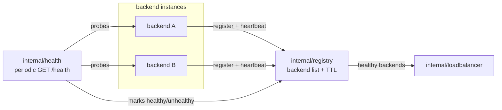

# api-gateway

A stdlib-only Go API Gateway / Load Balancer, built from scratch to actually understand how gateway internals work: reverse proxying, dynamic service discovery (backends self-register with a TTL heartbeat), health checking, load balancing (round-robin, least-connections, weighted round-robin), rate limiting, circuit breaking, and API-key auth.

No router/proxy framework — just `net/http`, `net/http/httputil`, `sync`, and `context`.

## Architecture

Request path through the gateway's middleware chain:

```mermaid
flowchart LR
    Client(["Client"]) --> RateLimit["internal/ratelimit\nglobal token bucket"]
    RateLimit --> Auth["internal/auth\nAPI key check"]
    Auth --> Router["internal/router\npath-prefix → service"]
    Router --> RouteLimit["internal/ratelimit\nper-route token bucket"]
    RouteLimit --> LB["internal/loadbalancer\npick healthy backend"]
    LB --> Breaker["internal/breaker\ncircuit check"]
    Breaker --> Proxy["internal/proxy\nreverse proxy"]
    Proxy --> Backend(["backend"])
```



The global rate limiter sits outside auth on purpose: if auth ran first, invalid-key brute-force attempts would never hit the limiter.

Backends discover themselves dynamically; the load balancer only ever sees what the registry currently considers healthy:



## Directory layout

```
cmd/gateway            — gateway process entrypoint
cmd/mockbackend         — self-registering mock backend, used by docker-compose.yml
internal/config        — config file (routes, ports, limits) loading
internal/registry      — backend self-registration + TTL/heartbeat
internal/health        — periodic backend health checks
internal/router        — path-prefix → service routing
internal/proxy         — reverse proxy to the selected backend
internal/loadbalancer  — round-robin / least-connections / weighted round-robin
internal/ratelimit     — per-client-IP token bucket
internal/breaker       — per-backend circuit breaker
internal/auth          — API key middleware
internal/metrics       — request counters + /metrics endpoint
```

## Running with Docker Compose

```
docker compose up --build
```

Starts the gateway plus three self-registering mock backends (`user-a`, `user-b` on `user-service`; `order-a` on `order-service`), wired together on the compose network. `scripts/docker-demo.sh` brings the stack up, runs a scenario suite against it (routing, auth, load balancing, health-driven failover, rate limiting), and tears everything down:

```
./scripts/docker-demo.sh
```
